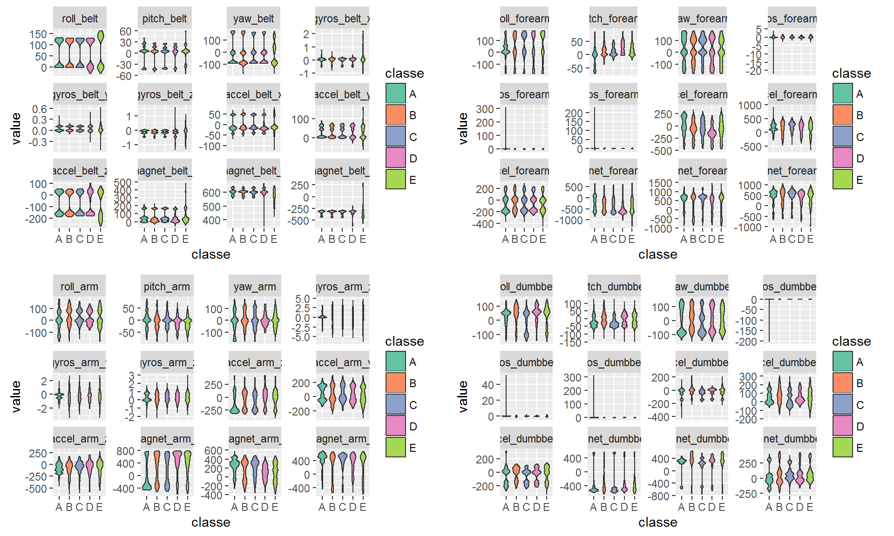
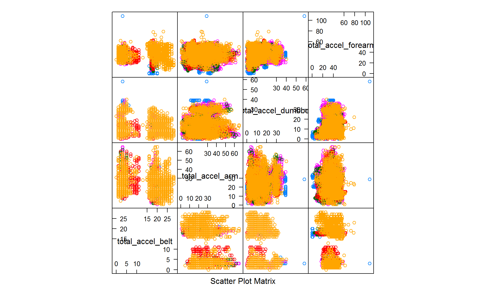
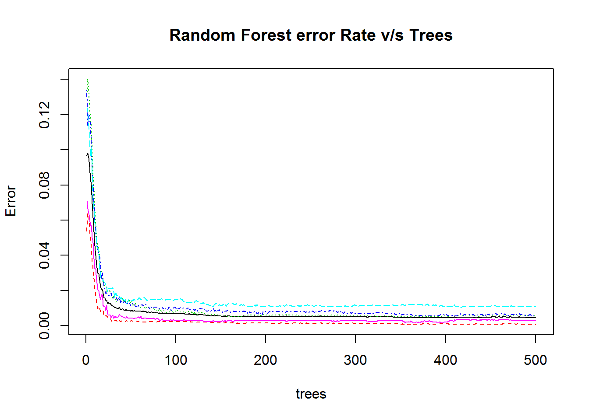
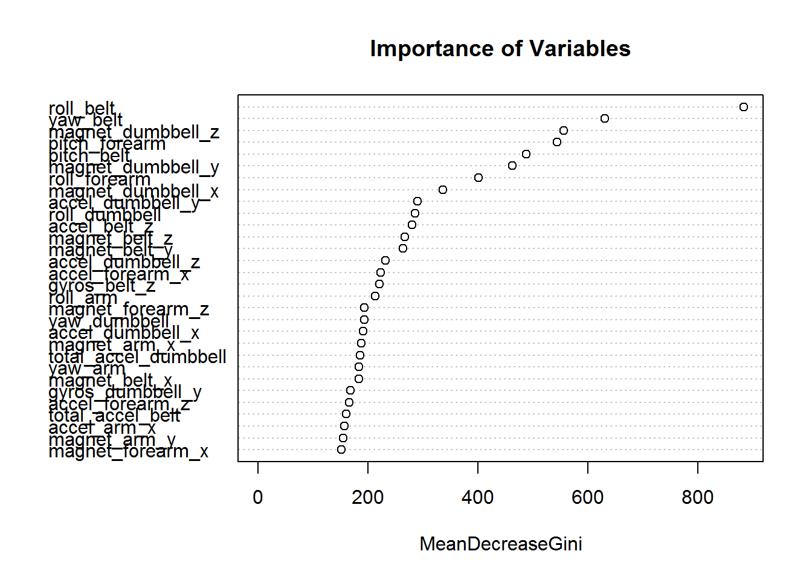

Synopsis
--------

The objective of the predict the manner in which a group of subjects
excercised, which is classified by the classe variable, with levels
A,B,C,D,E. The accelerometers attached to the **arm, forearm, belt and
dumbbell** on 6 subjects are noted in the dataset. **The goal of this
project is to further identify how well a person does an excercise**.
For the same reason, the participants were asked to do the excercise
(barbell lift) correctly and incorrectly, rated by the variable
'classe'. The data for this project come from this
[source](http://groupware.les.inf.puc-rio.br/har).

Data collection
---------------

Training and testing dataset are from the links
[1](https://d396qusza40orc.cloudfront.net/predmachlearn/pml-training.csv)
and
[2](https://d396qusza40orc.cloudfront.net/predmachlearn/pml-testing.csv)
respectively. Checking is done to find if the files are already in the
working directory, and is downloaded otherwise. The csv files are read
in. On initial analysis of file it was found that the NA strings are
coded as \#DIV/0! and NA, both the files are read in with NA strings to
be all read in as NA.

    if (!("trainDF.csv" %in% list.files())){
            trainURL <- "https://d396qusza40orc.cloudfront.net/predmachlearn/pml-training.csv"
            download.file(trainURL, destfile = "trainDF.csv") 
            rm(trainURL)
    }

    if (!("predictDF.csv" %in% list.files())){
            testURL <- "https://d396qusza40orc.cloudfront.net/predmachlearn/pml-testing.csv"
            download.file(testURL, destfile =  "predictDF.csv")
            rm(testURL)
    }

    trainDF <- read.csv("trainDF.csv", na.strings = c(NA,"#DIV/0!",""))
    predictDF <- read.csv("predictDF.csv", na.strings = c(NA,"#DIV/0!",""))

The training dataset has 19622 rows and 160 variables and the testing
dataset for which the classe output needs to be found has the same 160
variables with 20 rows.

Data Splitting
--------------

The training dataset from the url is further split into training and
testing dataset with 70-30 data split based on the classe variable.

    set.seed(12342)
    inTrain <- createDataPartition(trainDF$classe, p = 0.7, list = FALSE)

    training <- trainDF[inTrain,]
    testing <- trainDF[-inTrain,]

Cleaning the data and Covariate selection
-----------------------------------------

On observing the data, we need only the accelerometer values from the
dumbell, arm, forearm and belt to predict the "classe" output, which
justifies the removal of any other variables that does not give those
measurements. Further, the variables that does not have much variance
and thereby provide insignificant effect on the prediction or modelling
are removed. It is also seen that the columns with higher percentages of
NA values are removed to provide a cleaner dataset.

    #removing variables other than sensor values and classe (output variable)
    # ^ inside [] to differentiate from arm from forearm

    rmVar <- colnames(training)[-grep("[^fore]arm|belt|dumbbell|forearm|classe",
                                     colnames(training))]

    nsv <- nearZeroVar(training[,(!(colnames(training) %in% rmVar))],
                       saveMetrics = TRUE)
    # removing variables with zero variance
    rmVar <- c(rmVar, row.names(nsv)[which(nsv$nzv)])

    # finding columns with percentage of NA values
    temp <- sapply(training[,(!(colnames(training) %in% rmVar))], 
                   function(x){sum(is.na(x))/nrow(training)})

    # removing columns with NA accounting for 70% of values
    rmVar <- c(rmVar, names(temp[temp>0.7]))

    # Cleaning up the training, testing and prediction datasets
    trainNew <- training[,(!(colnames(training) %in% rmVar))]
    testNew <- testing[,(!(colnames(testing) %in% rmVar))]
    predictNew <- predictDF[,(!(colnames(predictDF) %in% rmVar))]

    # training set data and type
    str(trainNew)

    ## 'data.frame':    13737 obs. of  53 variables:
    ##  $ roll_belt           : num  1.41 1.41 1.48 1.48 1.45 1.42 1.42 1.43 1.45 1.43 ...
    ##  $ pitch_belt          : num  8.07 8.07 8.05 8.07 8.06 8.09 8.13 8.16 8.17 8.18 ...
    ##  $ yaw_belt            : num  -94.4 -94.4 -94.4 -94.4 -94.4 -94.4 -94.4 -94.4 -94.4 -94.4 ...
    ##  $ total_accel_belt    : int  3 3 3 3 3 3 3 3 3 3 ...
    ##  $ gyros_belt_x        : num  0 0.02 0.02 0.02 0.02 0.02 0.02 0.02 0.03 0.02 ...
    ##  $ gyros_belt_y        : num  0 0 0 0.02 0 0 0 0 0 0 ...
    ##  $ gyros_belt_z        : num  -0.02 -0.02 -0.03 -0.02 -0.02 -0.02 -0.02 -0.02 0 -0.02 ...
    ##  $ accel_belt_x        : int  -21 -22 -22 -21 -21 -22 -22 -20 -21 -22 ...
    ##  $ accel_belt_y        : int  4 4 3 2 4 3 4 2 4 2 ...
    ##  $ accel_belt_z        : int  22 22 21 24 21 21 21 24 22 23 ...
    ##  $ magnet_belt_x       : int  -3 -7 -6 -6 0 -4 -2 1 -3 -2 ...
    ##  $ magnet_belt_y       : int  599 608 604 600 603 599 603 602 609 602 ...
    ##  $ magnet_belt_z       : int  -313 -311 -310 -302 -312 -311 -313 -312 -308 -319 ...
    ##  $ roll_arm            : num  -128 -128 -128 -128 -128 -128 -128 -128 -128 -128 ...
    ##  $ pitch_arm           : num  22.5 22.5 22.1 22.1 22 21.9 21.8 21.7 21.6 21.5 ...
    ##  $ yaw_arm             : num  -161 -161 -161 -161 -161 -161 -161 -161 -161 -161 ...
    ##  $ total_accel_arm     : int  34 34 34 34 34 34 34 34 34 34 ...
    ##  $ gyros_arm_x         : num  0 0.02 0.02 0 0.02 0 0.02 0.02 0.02 0.02 ...
    ##  $ gyros_arm_y         : num  0 -0.02 -0.03 -0.03 -0.03 -0.03 -0.02 -0.03 -0.03 -0.03 ...
    ##  $ gyros_arm_z         : num  -0.02 -0.02 0.02 0 0 0 0 -0.02 -0.02 0 ...
    ##  $ accel_arm_x         : int  -288 -290 -289 -289 -289 -289 -289 -288 -288 -288 ...
    ##  $ accel_arm_y         : int  109 110 111 111 111 111 111 109 110 111 ...
    ##  $ accel_arm_z         : int  -123 -125 -123 -123 -122 -125 -124 -122 -124 -123 ...
    ##  $ magnet_arm_x        : int  -368 -369 -372 -374 -369 -373 -372 -369 -376 -363 ...
    ##  $ magnet_arm_y        : int  337 337 344 337 342 336 338 341 334 343 ...
    ##  $ magnet_arm_z        : int  516 513 512 506 513 509 510 518 516 520 ...
    ##  $ roll_dumbbell       : num  13.1 13.1 13.4 13.4 13.4 ...
    ##  $ pitch_dumbbell      : num  -70.5 -70.6 -70.4 -70.4 -70.8 ...
    ##  $ yaw_dumbbell        : num  -84.9 -84.7 -84.9 -84.9 -84.5 ...
    ##  $ total_accel_dumbbell: int  37 37 37 37 37 37 37 37 37 37 ...
    ##  $ gyros_dumbbell_x    : num  0 0 0 0 0 0 0 0 0 0 ...
    ##  $ gyros_dumbbell_y    : num  -0.02 -0.02 -0.02 -0.02 -0.02 -0.02 -0.02 -0.02 -0.02 -0.02 ...
    ##  $ gyros_dumbbell_z    : num  0 0 -0.02 0 0 0 0 0 0 0 ...
    ##  $ accel_dumbbell_x    : int  -234 -233 -232 -233 -234 -232 -234 -232 -235 -233 ...
    ##  $ accel_dumbbell_y    : int  47 47 48 48 48 47 46 47 48 47 ...
    ##  $ accel_dumbbell_z    : int  -271 -269 -269 -270 -269 -270 -272 -269 -270 -270 ...
    ##  $ magnet_dumbbell_x   : int  -559 -555 -552 -554 -558 -551 -555 -549 -558 -554 ...
    ##  $ magnet_dumbbell_y   : int  293 296 303 292 294 295 300 292 291 291 ...
    ##  $ magnet_dumbbell_z   : num  -65 -64 -60 -68 -66 -70 -74 -65 -69 -65 ...
    ##  $ roll_forearm        : num  28.4 28.3 28.1 28 27.9 27.9 27.8 27.7 27.7 27.5 ...
    ##  $ pitch_forearm       : num  -63.9 -63.9 -63.9 -63.9 -63.9 -63.9 -63.8 -63.8 -63.8 -63.8 ...
    ##  $ yaw_forearm         : num  -153 -153 -152 -152 -152 -152 -152 -152 -152 -152 ...
    ##  $ total_accel_forearm : int  36 36 36 36 36 36 36 36 36 36 ...
    ##  $ gyros_forearm_x     : num  0.03 0.02 0.02 0.02 0.02 0.02 0.02 0.03 0.02 0.02 ...
    ##  $ gyros_forearm_y     : num  0 0 -0.02 0 -0.02 0 -0.02 0 0 0.02 ...
    ##  $ gyros_forearm_z     : num  -0.02 -0.02 0 -0.02 -0.03 -0.02 0 -0.02 -0.02 -0.03 ...
    ##  $ accel_forearm_x     : int  192 192 189 189 193 195 193 193 190 191 ...
    ##  $ accel_forearm_y     : int  203 203 206 206 203 205 205 204 205 203 ...
    ##  $ accel_forearm_z     : int  -215 -216 -214 -214 -215 -215 -213 -214 -215 -215 ...
    ##  $ magnet_forearm_x    : int  -17 -18 -16 -17 -9 -18 -9 -16 -22 -11 ...
    ##  $ magnet_forearm_y    : num  654 661 658 655 660 659 660 653 656 657 ...
    ##  $ magnet_forearm_z    : num  476 473 469 473 478 470 474 476 473 478 ...
    ##  $ classe              : Factor w/ 5 levels "A","B","C","D",..: 1 1 1 1 1 1 1 1 1 1 ...

The resultant datasets have **52** predictor variables to predict the
***classe*** output.

Plotting Predictors
-------------------

There are **52** predictor variables involved, and plotting them all on
a map might be tedious. For easier viewing the different accelerometer
values (arm, forearm, belt and dumbbell) are plotted seperately.

    plotVar <- function(dframe, string){
            string <- paste0(string,"|classe")
            rmVar <- grep("total", names(dframe))
            dframe <- dframe[,-rmVar]
            colVar <- grep(string, colnames(dframe))
            newDF <- melt(dframe[,colVar], id = "classe")
            #https://www3.nd.edu/~steve/computing_with_data/13_Facets/facets.html
            ggplot(data = newDF, aes(x = classe, y = value)) + 
                    geom_violin(aes(fill = classe)) + 
                    scale_fill_brewer(palette = "Set2") + 
                    facet_wrap(~variable, scales = "free_y") 
    }

    gph1 <- plotVar(trainNew, "belt")
    gph2 <- plotVar(trainNew, "forearm")
    gph3 <- plotVar(trainNew, "[^fore]arm")
    gph4 <- plotVar(trainNew, "dumbbell")

    grid.arrange(gph1, gph2, gph3, gph4, ncol=2)

    colVar <- grep("total|classe", names(trainNew))
    dframe <- trainNew[,colVar]

    featurePlot(x = dframe[,1:4], y = dframe$classe, plot = "pairs")

The predictors are plotted as above, the distribution of individual
snsor values over the 5 different classe types are plotted. Violin plot
is used to show the variance and density of the individual data points.
The pair plot of total sensor values are also drawn to check for
distinction between the different classes.

RandomForest modeling
---------------------

After selecting the ideal covariates by checking for their variablity in
affecting the outcome and removing the variables without significant
data, the next step is to model and train the data.  
Using Random Forest to model the training data. Cross validation is not
done here, since it is not necessary to get unbiased estimate of the
test set error in random forest modelling. The reason being it is
already taken care by the random forest package, ie, even in the absence
of a new data the out-of-bag prediction is returned.

The aim is to model the output "classe" based on all the sensor values.
Instead of the train() function from the caret package, the randomForest
function is used since it provided the results in less than 4 minutes as
compared to hours took with train() function.

    set.seed(12342)
    modFit_rf <- randomForest(as.factor(trainNew$classe)~., data = trainNew[,-53],
                              method = "class")

### In & Out of Sample Error and Prediction Accuracy

In sample error refers to the error incurred when predicting on the
sample data and out of sample error refers to the error incurred on
predicting with the test data. As expected the in sample error will be
less than the out of sample error.

    ## Confusion Matrix and Statistics
    ## 
    ##           Reference
    ## Prediction    A    B    C    D    E
    ##          A 1670    4    0    0    0
    ##          B   10 1127    2    0    0
    ##          C    0    2 1024    0    0
    ##          D    0    0   10  954    0
    ##          E    0    0    0    1 1081
    ## 
    ## Overall Statistics
    ##                                         
    ##                Accuracy : 0.995         
    ##                  95% CI : (0.993, 0.997)
    ##     No Information Rate : 0.285         
    ##     P-Value [Acc > NIR] : <2e-16        
    ##                                         
    ##                   Kappa : 0.994         
    ##  Mcnemar's Test P-Value : NA            
    ## 
    ## Statistics by Class:
    ## 
    ##                      Class: A Class: B Class: C Class: D Class: E
    ## Sensitivity             0.994    0.995    0.988    0.999    1.000
    ## Specificity             0.999    0.997    1.000    0.998    1.000
    ## Pos Pred Value          0.998    0.989    0.998    0.990    0.999
    ## Neg Pred Value          0.998    0.999    0.998    1.000    1.000
    ## Prevalence              0.285    0.193    0.176    0.162    0.184
    ## Detection Rate          0.284    0.192    0.174    0.162    0.184
    ## Detection Prevalence    0.284    0.194    0.174    0.164    0.184
    ## Balanced Accuracy       0.997    0.996    0.994    0.998    1.000

In the training set, an accuracy of 100.00% is obtained, which means
that the in sample error will be 0.00 %. Similarly an accuracy of 99.51%
is obtained, with an out sample error of 0.49%.

#### Error rate v/s Trees

    plot(modFit_rf, main = "Random Forest error Rate v/s Trees")

From the graph it is evident that with the increase in number of trees
the error rate decreases.

### Importance of Variables

Variable importance is an important output of the random forest model,
it explains the importance of each variable in predicting the outcome.
It is plotted with the most important to least important with variables
on y-axis and importance levels on x-axis.

    varImpPlot(modFit_rf, main = "Importance of Variables")

According to the graph **roll\_belt** variable has the most importance
followed by **yaw\_belt** with **magnet\_forearm\_y** having the least
importance

Predicting Values
-----------------

Predicted Values for the testing dataset provided are as follows, and
are obtained by applying the random model fitted to the training set.

    predict(modFit_rf, newdata = predictNew[-53], type="class")

    ##  1  2  3  4  5  6  7  8  9 10 11 12 13 14 15 16 17 18 19 20 
    ##  B  A  B  A  A  E  D  B  A  A  B  C  B  A  E  E  A  B  B  B 
    ## Levels: A B C D E

Decision tree
-------------

In order to compare the accuracy, decision tree algorithm can be run on
the data with crossvalidation.

    modFit_dt <- train(classe~., data = trainNew, method = "rpart", 
                       trControl = trainControl("cv"))
    cf_dtout <- confusionMatrix(testNew$classe, predict(modFit_dt, 
                    newdata = testNew[,-53]))
    cf_dtin <- confusionMatrix(trainNew$classe, predict(modFit_dt, 
                    newdata = trainNew[,-53]))

In the training set, an accuracy of 49.17% is obtained, which means that
the in sample error will be 50.83 %. Similarly an accuracy of 50.45% is
obtained, with an out sample error of 49.55%.

Conclusion
----------

From the two algorithms used, it is evident that a random forest model
offers better prediction result of 0.49% compared to the simple decision
tree.
